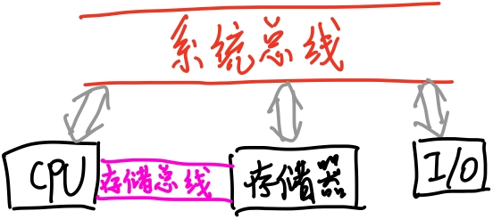

## **第一周作业**

1. ###### 写出下列三组英文缩写的英文全称，并翻译为中文。

###### （1）CPU；ALU

Central Processing Unit 中央处理器

Arithmetic and Logic Unit 算数逻辑单元

###### （2）ROM；RAM；SRAM；DRAM；

Read Only Memory 只读存储器

Random Access Memory 随机存取存储器

Static Random Access Memory 静态随机存取存储器

Dynamic Random Access Memory 动态随机存取存储器

###### （3）DSP；MCU；MPU；

Digital Signal Processor 数字信号处理器

Micro Controller Unit 微控制器

Micro Processing Unit 微处理器

###### （4）DMA；UART；

Direct Memory Access 直接内存访问

Universal Asynchronous Receiver/Transmitter 通用异步收发传输器

###### （5）CISC；RISC

Complex Instruction Set Computer 复杂指令系统计算机

Reduced Instruction Set Computer 精简指令集计算机

2. ###### 什么是冯·诺依曼机？

   即基于冯诺依曼提出的架构而制成的计算机。冯诺依曼机由存储器、运算器、控制器、输入设备和输出设备组成。

3. ###### 冯.诺伊曼架构（也称为普林斯顿架构）与哈佛架构有什么不同？

   冯诺依曼架构中，程序和数据共享同样的内存区域

   哈佛架构中，程序和数据分别占有独立的内存区域

4. ###### 存储器中可存放数据和指令代码，计算机是通过什么来存取数据或指令代码？

   通过总线。地址总线上的信号结合地址选择器选择存储芯片和内存区域；数据总线上的数据传输数据/指令代码；控制总线传输控制器发送的控制信号，协调存取操作。

5. ###### 什么是计算机总线？什么是系统总线？微型计算机的系统总线包括了三总线，三总线是指哪三种总线?

   计算机总线是计算机各种功能部件之间交换信息的公共通信线。

   系统总线是连接CPU，存储器和I/O口的一种计算机总线。

   三总线包括：

   - 地址总线
   - 数据总线
   - 控制总线

6. ###### CISC和RISC的英文全称分别是什么？比较CISC和RISC。

   Complex Instruction Set Computer 复杂指令系统计算机

   Reduced Instruction Set Computer 精简指令集计算机

   CISC：指令长度可变，指令执行时间可变，指令种类多，流水线调度实现困难，向下兼容

   RISC：指令长度固定，指令执行时间固定，指令种类少，流水线调度实现简单

7. ###### 列出计算机系统中的三种总线结构，画出面向存储器的双总线结构图。

   - 三总线结构：主存总线、系统总线和直接内存访问总线
   - 双总线结构：主存总线、系统总线
   - 单总线结构：只有一条系统总线，所有的部件都连接到这条总线上

   面向存储器的双总线结构图：

   

8. ###### 将下列二进制数转换为十进制数。

###### （1）1101.01B （2）111001.0011B （3）101011.0101B （4）111.0001B

- 1101.01B = 13.25D
- 111001.0011B = 57.1875D
- 101011.0101B = 43.3125D
- 111.0001B = 7.0625D

9. ###### 将下列十进制数转换为二进制、十六进制。

###### （1）23 （2）107 （3）1238 （4）92

- 23D = 10111B = 17H
- 107D = 1101011B = 6BH
- 1238D = 10011010110B = 4D6H
- 92D = 1011100B = 5CH

10. ###### 将下列十进制数转换为16位有符号二进制数。

###### （1）+32 （2）-12 （3）+100 （4）-9

- +32 = 0000000000100000
- -12 = 1000000000001100
- +100 = 0000000001100100
- -9 = 1000000000001001

11. ######  将下列十进制数转换为IEEE754单精度浮点数。

###### （1）+1.5 （2）-10.625 （3）+100.2 (4)1200

- 0 01111111 10000000000000000000000
- 1 10000010 01010100000000000000000
- 0 10000101 10010000110011001100110
- 0 10001001 00101100000000000000000

12. ###### 将下列单精度浮点数转换为十进制数。

###### （1）0 10000000 1100000 00000000 00000000

###### （2）1 01111111 0000000 00000000 00000000

###### （3）0 10000000 1001000 00000000 00000000

- 3.5
- -1
- 3.125

## 第二周作业. 8086CPU

1. ###### 8086CPU可以分为EU和BIU两部分，它们的主要功能分别是什么？

2. ###### 8086CPU指令的执行可以分为几级流水（pipeline）？这样设计有何好处？理论最大加速比是多少？为什么实际加速比达不到最大加速比？

 

3. ###### 熟悉课件中有关8086CPU中通用数据寄存器、指针类寄存器、段基址寄存器的用途。（本题不用写答案）。

4. ###### 熟悉课件中8086中Flag寄存器的6个标志位和3个控制位。（本题不用写答案）

5. ###### 8086 系统中存储器采用什么结构？用什么信号来选中存储体？

6. ###### 若CS:IP=1A00H:B000H，求出要执行的下一条指令的存储器物理地址。

7. ###### 求下列寄存器组合所寻址的存储单元地址：

###### （1）DS: BX =A000H:1000H （2）SS:SP=2900H:3A00H

8. ###### CPU为Intel8086，当前 SS=3500H，SP=0800H；

###### （1）说明堆栈段在存储器中的物理地址

###### （2）若此时入栈10个字节，SP 内容是什么？

###### （3）若再出栈6个字节，SP 为什么值？

 

9. ###### 某8086计算机程序的数据段中存放了两个字，1EE5H 和2A8CH，已知DS=7850H，数据存放的偏移地址分别为3121H 及285AH。试画图说明它们在存储器中的存放情况。若要读取这两个字，需要对存储器进行几次操作？

 

## 第三周 作业

1. ###### 8086CPU 重新启动后，

###### (1) CS:IP的初始值为多少？寄存器CS:IP必须被正确初始化？

###### (2) 8086CPU从何处开始执行指令？

2. ###### 分别说明下列指令的源操作数和目的操作数各采用什么寻址方式。

###### （1）MOV AX，2408H （2）MOV CL，0FFH （3）MOV BX，[SI]

###### （4）MOV 5[BX]，BL （5）MOV [BP+100H]，AX （6）MOV [BX+DI]，’$’

###### （7）MOV DX，ES：[BX+SI] （8）MOV VAL[BP+DI]，DX

###### （9）IN AL，05H （10）MOV DS，AX

3. ###### 已知：DS=1000H，BX=0200H，SI=02H，内存10200H～10205H 单元的内容分别为10H，2AH，3CH，46H，59H，6BH。下列每条指令执行完后AX 寄存器的内容各是什么？

###### （1）MOV AX，0200H （2）MOV AX，[200H] （3）MOV AX，BX

###### （4）MOV AX，3[BX] （5）MOV AX，[BX+SI] （6）MOV AX，2[BX+SI]

4. ###### 指出下列指令中哪些是错误的，错在什么地方。

###### （1）MOV DL，AX （2）MOV 8650H，AX （3）MOV DS，0200H

###### （4）MOV [BX]，[1200H] （5）MOV IP，0FFH （6）MOV [BX+SI+3]，IP

###### （7）MOV AX，[BX][BP] （8）MOV AL，ES：[BP] （9）MOV DL，[SI][DI]

###### （10）MOV AX，OFFSET 0A20H （11）MOV AL，OFFSET TABLE

###### （12）XCHG AL，50H （13）IN BL，05H （14）OUT AL，0FFEH

5. ###### 下列指令完成什么功能？

###### （1）ADD AL，DH （2）ADC BX，CX （3）SUB AX，2710H

###### （4）DEC BX （5）NEG CX （6）INC BL

###### （7）MUL BX （8）DIV CL

6. ###### 在下列程序段括号中分别填入以下指令

###### （1）LOOP NEXT （2） LOOPE NEXT （3） LOOPNE NEXT

###### 试说明在这三种情况下，程序段执行完后，AX，BX，CX，DX 的内容分别是什么。

###### START: MOV AX,01H

###### MOV BX,02H

###### MOV DX,03H

###### MOV CX,04H

###### NEXT: INC AX

###### ADD BX,AX

###### SHR DX,1

###### (   )

 

7. ###### 什么叫中断？8086系统中，什么叫可屏蔽中断和不可屏蔽中断？

8. ###### 中断向量表的作用是什么？它放在内存的什么区域内？中断向量表中的什么地址用于类型3 的中断？

9. ###### 8086系统中，设类型2 的中断服务程序的起始地址为0485：0016H，它在中断向量表中如何存放？

10. ###### 8086系统中，若中断向量表中地址为0040H 中存放240BH，0042H 单元里存放的是D169H，试问：（1）这些单元对应的中断类型是什么？（2）该中断服务程序的起始地址是什么？