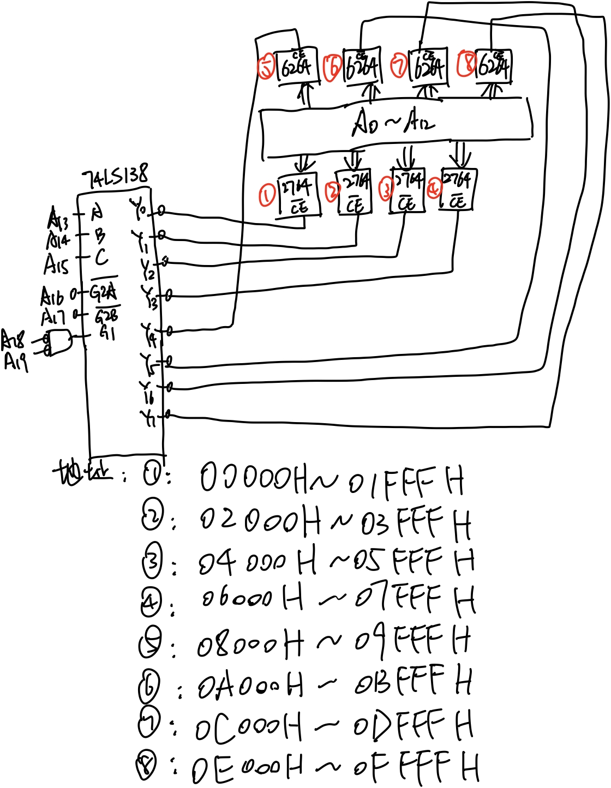
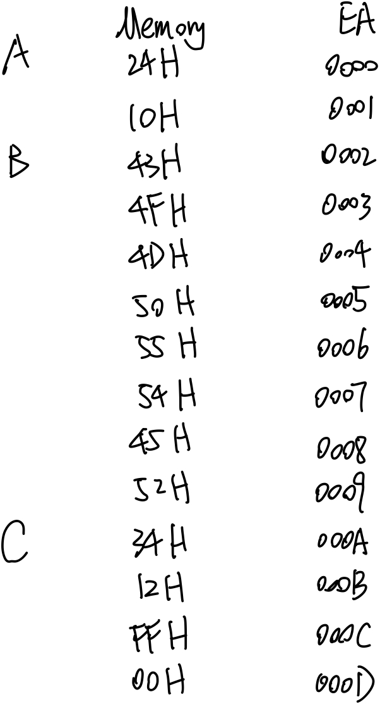
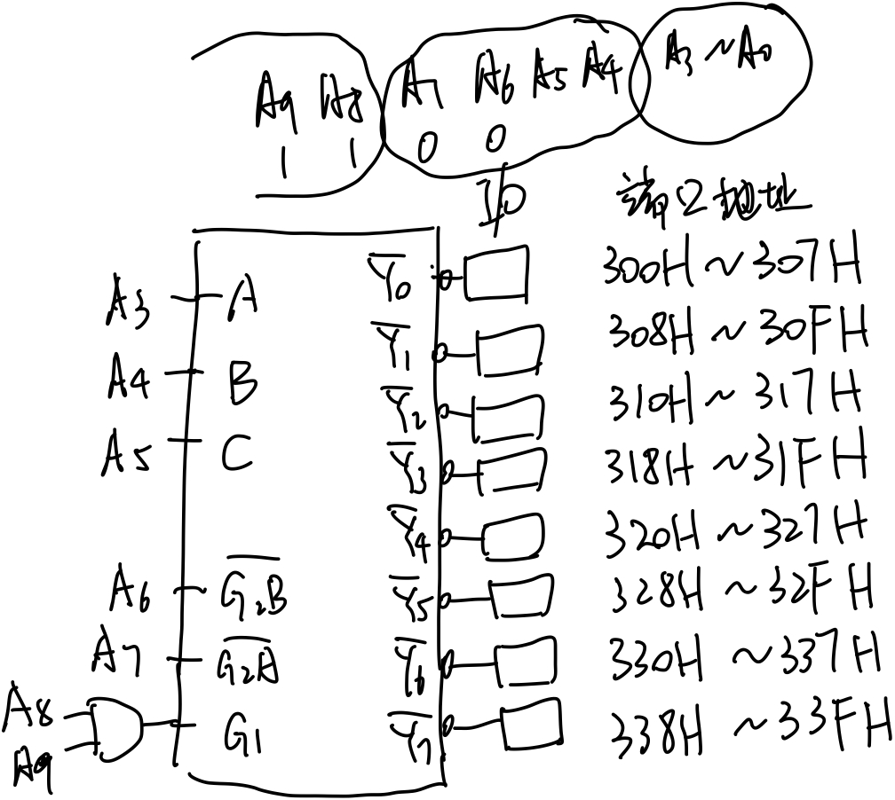

## 第五周 存储器作业

###### 刘涵之 519021910102

1. ##### 静态RAM与动态RAM有何区别？

静态RAM: 不需要进行刷新，功耗大，难集成，运行速度快，价格高

动态RAM: 需要定时刷新，功耗低，集成度高（MOS管），运行速度慢，价格便宜

2. ##### ROM、PROM、EPROM、EEPROM在功能上各有何特点？

ROM：只读存储器，不能进行读写操作

PROM：可编程只读存储器，只允许写入一次

EPROM：可擦除可编程只读存储器，写完之后可以擦除然后重新写入

EEPROM：电可擦除可编程只读存储器，可以用电信号擦除/写入数据

3. ##### 什么是Cache？作用是什么？它处在微处理机中的什么位置？

高速缓存，是介于主存和CPU之间的高速小容量存储器。

作用是为了减小CPU与内存之间的速度差异，加入缓存机制，提高系统性能，使得CPU可以较快的在cache中存取数据。

位置：CPU <--->   Cache <--->  DRAM  <---> HDD

4. ##### 用1024×1位的RAM芯片组成16K×8位的存储器，需要多少芯片？在地址线中有多少位参与片内寻址？多少位组合成片选择信号？（设地址总线为16位）

需要16*8片（128片）

片内1024个单元，有10位参与片内寻址

128片（1bit），16组（8bit），需要4位参与片选

5. ##### 现有一存储体芯片容量为512×4位，若要用它组成4KB的存储器，需要多少这样的芯片？每块芯片需要多少寻址线？整个存储系统最少需要多少寻址线？

4KB/512x4b = 16片

每块芯片有512个单元，需要9根片内寻址线

16片（4bit），8组（8bit），需要3根片选寻址。一共需要12根寻址线

6. ##### 利用1024×8位的RAM芯片组成4K×8位的存储器系统，试用A15～A12地址线用线性选择法（注：只用一根地址线做存储器的片选信号）产生片选信号，存储器的地址分配有什么问题，并指明各芯片的地址分配。

需要4片这样的RAM芯片。

A15取反后分配给芯片1的CS，地址：8000H ~ 83FFH（1024个），8400H ~ 87FFH，8800H ~ 8BFFH，8C00H ~ 8FFFH 

A14取反后分配给芯片2的CS，地址：4000H ~ 43FFH，4400H ~ 47FFH，4800H ~ 4BFFH，4C00H ~ 4FFFH 

A13取反后分配给芯片3的CS，地址：2000H ~ 23FFH，2400H ~ 27FFH，2800H ~ 2BFFH，2C00H ~ 2FFFH 

A12取反后分配给芯片4的CS，地址：1000H ~ 13FFH，1400H ~ 17FFH，1800H ~ 1BFFH，1C00H ~ 1FFFH 

问题：同一个地址对应多个存储单元，地址不唯一

7. ##### 当从存储器偶地址单元读一个字节数据时，写出存储器的控制信号和它们的有效逻辑电平信号。（8086工作在最小模式）

8086向地址总线发出20位地址数据和BHE# = 1，通过地址锁存信号锁存至8282，然后发出M/IO# = 1和 RD=0，20位地址信号和BHE# =1送给存储器，经过译码，选中偶地址单元的一个字节数据，将数据送到数据总线，经过DEN# =0和DT/R#=0控制的8286传送至CPU。

8. ##### 当要将一个字写入到存储器奇地址开始的单元中去，列出存储器的控制信号和它们的有效逻辑电平信号。（8086工作在最小模式）

- 首先，BHE#=0，将字的低8位写入存储器奇地址
- 然后，BHE#=1，将字的高8位写入这个存储器奇地址的下一个地址（偶地址）
- 其余控制信号M/IO#=1，WR#=0，DEN#=0，DT/R#=1

9. ##### 用8K×8位的EPROM2764、8K×8位的RAM6264和译码器74LS138构成一个16K字ROM、16K字RAM的存储器子系统。8086工作在最小模式，系统带有地址锁存器8282，数据收发器8286。画出存储器系统与CPU的连接图，写出各块芯片的地址分配。

10. ##### 已知程序的数据段定义如下：

    ##### DATA SEGMENT

##### A DB ‘$’,10H

##### B DB ‘COMPUTER’

##### C DW 1234H, 0FFH

##### D DB 5 DUP(?)

##### E DD 1200459AH

##### DATA ENDS

##### （1）画出内存数据段中变量A-C所在的地址，并在对应的内存单元中填入正确的16进制数值

##### （2）求下列程序段执行后的结果是什么。

##### MOV AL, A    -> AL = 24H

##### MOV DX, C   -> DX = 1234H

##### XCHG DL, A   -> DL = 24H  A = 34H

##### MOV BX, OFFSET B   -> BX = 0002H

##### MOV CX, 3[BX]  -> CX = 5550H

##### LEA BX, D   -> BX = 000EH

 

 

## 第六周  输入输出接口

1. ##### CPU与外设交换数据时，为什么要通过I/O接口进行？

- 计算机与外设的速度不匹配，信号电平不匹配，信号格式不匹配，时序不匹配
- IO设备不能直接与CPU的系统总线相连
- 结论：需要通过专门的IO接口电路匹配CPU和IO设备

2. ##### 在微机系统中，缓冲器和锁存器各起什么作用？

缓冲器：具有三态输出能力，提高总线的驱动能力

锁存器：暂存数据，在输出控制信号的作用下将数据传送出去

3. ##### 什么叫I/O端口？一般的接口电路中可以设置哪些端口？计算机对I/O端口编址时采用哪两种方法？在8086/8088CPU中一般采用哪些编址方法？

- CPU与IO设备通信时，需要数据、状态和控制信息，这些信息分别保存入不同的寄存器，通常将这些寄存器和相应的控制逻辑称为IO端口

- 一般设置 数据、状态和命令端口
- 存储器映像寻址，IO单独编址
- 8086/8088CPU采用IO单独编址

5. ##### CPU与外设间传送数据主要有哪几种方式？

程序控制、中断、DMA方式

6. ##### 某一个微机系统中，有8块I/O接口芯片，每个芯片占有8个端口地址，若起始地址为300H，6.块芯片的地址连续分布，用74LS138做译码器，试画出端口译码电路，并说明每块芯片的端口地址范围。

