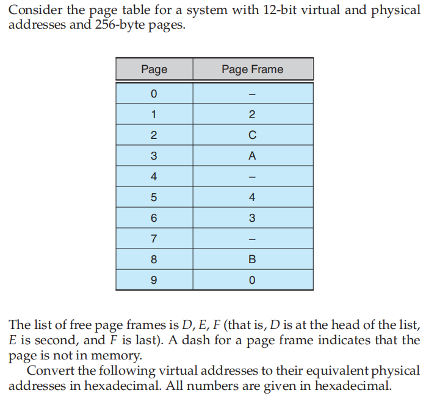
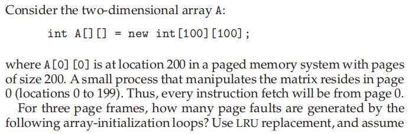
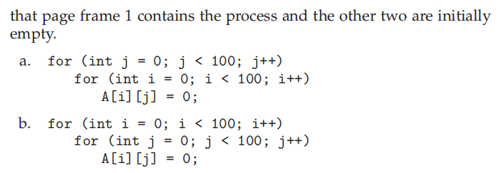
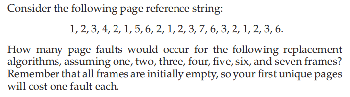
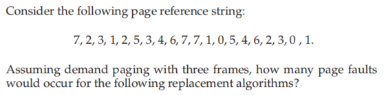

### 作业十

###### 姓名：刘涵之 学号：519021910102

Practice Exercice: 10.5, 10.7, 10.8, 10.9

------

##### 10.5 

- 9EF 
  - 256 = 2^8    12 - 8 = 4
  - 9 => 0
  - Virtual: 0EF
- 111
  - Virtual: 211
- 700
  - Virtual: D00
- 0FF
  - Virtual: EFF

##### 10.7 

- 5000 (每次i+2，就会page fault一次)
- 50（每次i+2，就会page fault一次）

##### 10.8 

| Frame | LRU  | FIFO | Optimal |
| ----- | ---- | ---- | ------- |
| 1     | 20   | 20   | 20      |
| 2     | 18   | 18   | 15      |
| 3     | 15   | 16   | 11      |
| 4     | 10   | 14   | 8       |
| 5     | 8    | 10   | 7       |
| 6     | 7    | 10   | 7       |
| 7     | 7    | 7    | 7       |

##### 10.9 

- LRU: 18
- FIFO: 17
- Optimal: 13