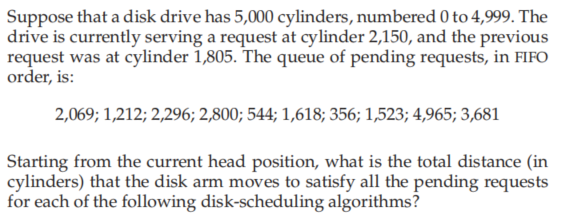
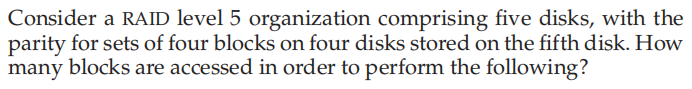

### 作业十一

###### 姓名：刘涵之 学号：519021910102

Practice Exercice: 11.13, 11.20

------

##### 11.13 

- FCFS
  - 初始：2150
  - 2069 1212 2296 2800 544 1618 356 1523 4965 3681
  - 12993
- SCAN
  - 初始：2150
  - 2296 2800 3681 4956 4999 2069 1618 1523 1212 544 356
  - 7492
- C-SCAN
  - 初始：2150
  - 2296 2800 3681 4956 4999 0 356 544 1212 1523 1618 2069
  - 9917

##### 11.20 

- a. A write of one block of data
  - 2
- b. A write of seven continuous blocks of data
  - 7 + 2 = 9

