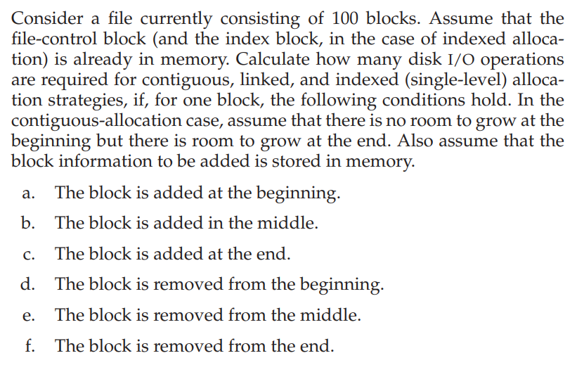

### 作业十四

###### 姓名：刘涵之 学号：519021910102

Practice Exercice: 14.1

------

##### 14.1 

|      | contiguous | linked | indexed (single-level) |
| ---- | ---------- | ------ | ---------------------- |
| a    | 201        | 1      | 1                      |
| b    | 101        | 52     | 1                      |
| c    | 1          | 102    | 1                      |
| d    | 198        | 1      | 0                      |
| e    | 98         | 52     | 0                      |
| f    | 0          | 100    | 0                      |

