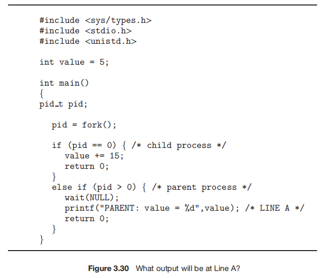
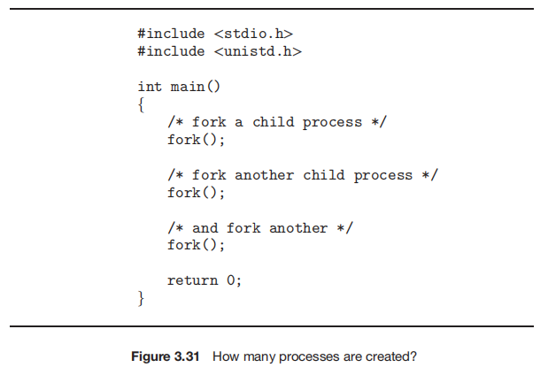

### Homework 3

###### Name: Hanzhi Liu (刘涵之) No: 519021910102

Practice Exercice: 3.1, 3.2, 3.4, 3.8, 3.10

------

##### 3.1 Using the program shown in Figure 3.30, explain what the output will be at LINE A.



The output will be: 

```
PARENT: value = 5
```

Because a child process is a copy of its parent process, they don't share the same memory space. So the variable are stored in different memory space, the data change in the child doesn't influence the parent.

##### 3.2 Including the initial parent process, how many processes are created by the program shown in Figure 3.31?



Eight. 

Its like: 

- origin process (fork_1)
  - parent (fork_2)
    - parent_parent (fork_3)
      - parent_parent_parent
      - parent_parent_child
    - parent_child (fork_3)
      - parent_child_parent
      - parent_child_child
  - child (fork_2)
    - child_parent (fork_3)
      - child_parent_parent
      - child_parent_child
    - child_child (fork_3)
      - child_child_parent
      - child_child_child

##### 3.4 Some computer systems provide multiple register sets. Describe what happens when a context switch occurs if the new context is already loaded into one of the register sets. What happens if the new context is in memory rather than in a register set and all the register sets are in use?

- if the new context is already loaded
  - just change the current-register-set pointer to the one that loads the new context
- if the new context is in memory and all the register sets are in use
  - select one of register sets and move its data to the memory
  - move the new context to the register set

##### 3.8 Describe the actions taken by a kernel to context-switch between processes.

When a kernel context-switch between the old and the new processes, it will first save the context of the old process in its PCBs and then load the  context of the new process.

##### 3.10 Explain the role of the init (or systemd) process on UNIX and Linux systems in regard to process termination.

When the process termination occurs, the process will be a zombie process until its parent process calls wait(), after which the process will be deleted in the process table. However, if its parent process terminates before calling wait(), the child process will be a orphan process. On UNIX/Linux, the init process will be the new parent process of orphan processes and calls wait() periodically to release them in the process table.