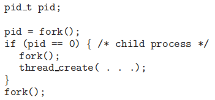
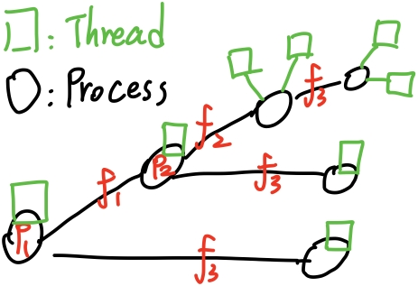

### Homework 4

###### Name: Hanzhi Liu (刘涵之) No: 519021910102

Practice Exercise: 4.1, 4.4, 4.10, 4.17, 4.19

------

##### 4.1 Provide three programming examples in which multithreading provides better performance than a single-threaded solution.

- web服务器响应客户机的请求（使用多线程的方式来实现并发响应）
- 使用多线程进行数组排序加速
- 使用多线程进行矩阵运算加速

##### 4.4 What are two differences between user-level threads and kernel-level threads? Under what circumstances is one type better than the other?

- 用户线程位于内核之上，管理无需内核提供支持；内核线程由内核直接支持并管理；用户线程由线程库进行调度；内核线程由内核进行调度
- 内核线程可以被操作系统感知；用户线程不可被操作系统感知
- 用户线程执行开销比内核线程小，执行效率比内核线程高

##### 4.10 Which of the following components of program state are shared across threads in a multithreaded process?

##### a. Register values

##### b. Heap memory

##### c. Global variables

##### d. Stack memory

堆内存(**Heap memory**)和全局变量(**Global variables**)是被线程共享的。

##### 4.17 Consider the following code segment:

##### 	a. How many unique processes are created?

##### b. How many unique threads are created?

- 一共有6个进程（5个是新创建的）
- 一共有8个线程（7个是新创建的）
- 

##### 4.19 The program shown in Figure 4.23 uses the Pthreads API. What would be the output from the program at LINE C and LINE P?

- LINE C： CHILD: value = 5
- LINE P:    PARENT: value = 0
- 因为fork后生成的子进程里创建了线程，子进程等待线程运行后再执行，value被修改为5。因为fork产生的子进程与父进程数据独立，所以父进程内的value还是0。