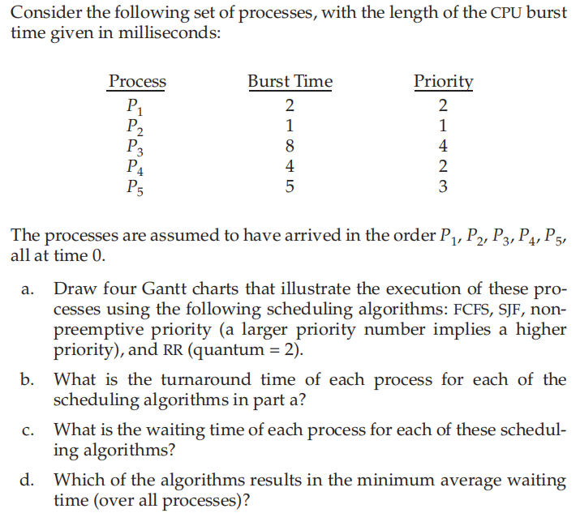
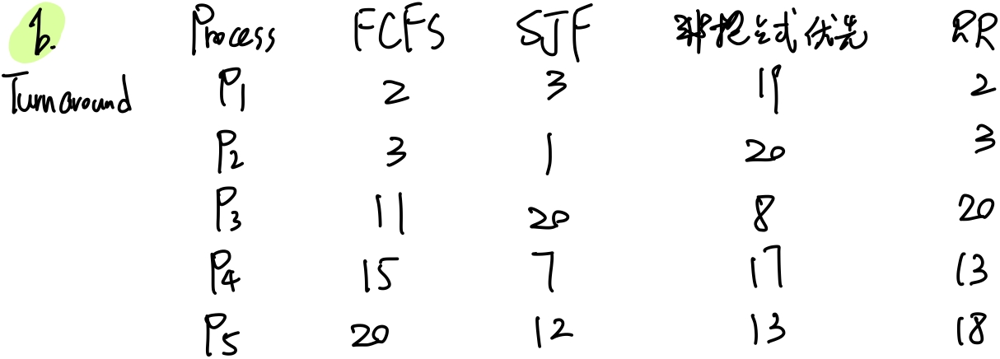
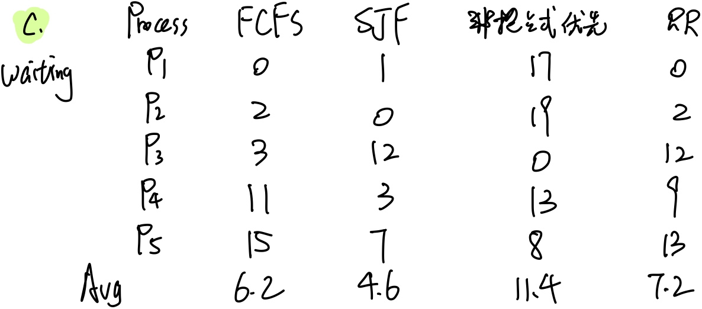
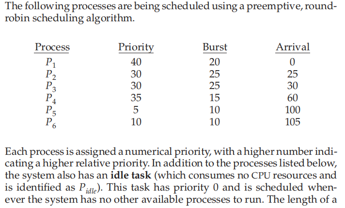
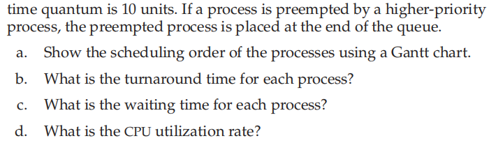
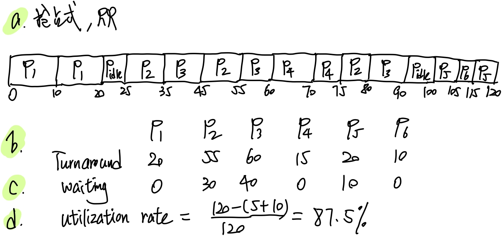
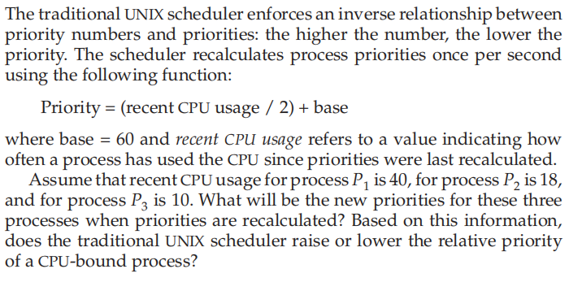
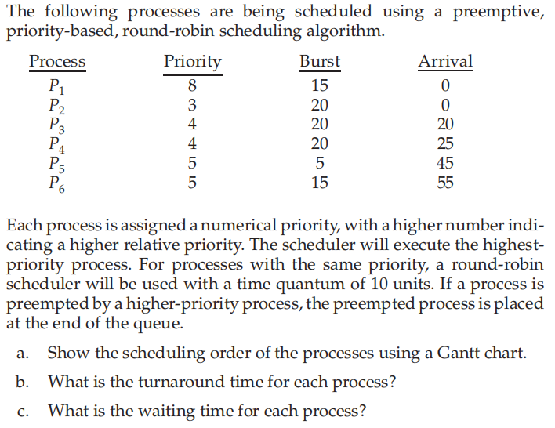

### Homework 5

###### Name: Hanzhi Liu (刘涵之) No: 519021910102

Practice Exercise: 5.4, 5.5, 5.10, 5.18, 5.20

------

##### 5.4 

##### d. SJF有最短平均等待时间

##### 5.5 

##### 5.10 

- new priorities: 
  - P~1~ = $\frac{40}{2}+60=80$
  - P~2~ = $\frac{18}{2}+60=69$
  - P~3~ = $\frac{10}{2}+60=65$
- cpu will lower the relative priority of CPU-bound processes

##### 5.18 

##### 5.20 Which of the following scheduling algorithms could result in starvation?

##### a. First-come, first-served

##### b. Shortest job first

##### c. Round robin

##### d. Priority

SJF和优先级调度会导致进程饥饿（不断有剩余时间短的进程进入；不断有优先级高的进程进入）

