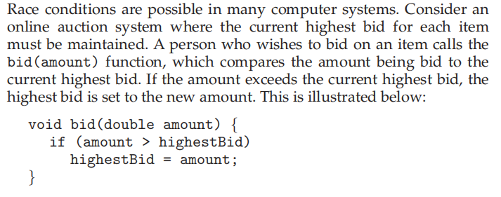
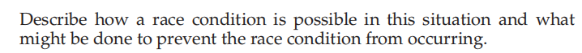
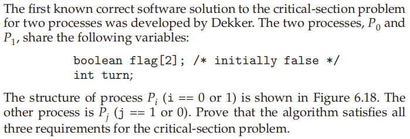
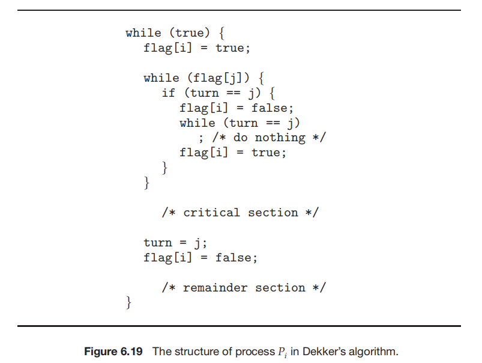
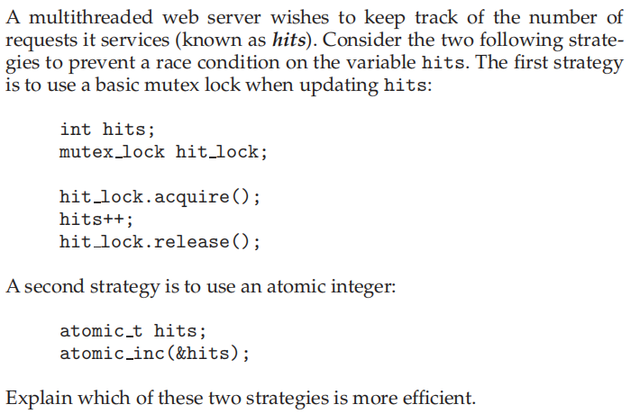

### 作业六

###### 姓名：刘涵之 学号：519021910102

Practice Exercice: 6.8, 6.13, 6.21

------

##### 6.8  

- 两个拍卖者都调用这个函数。两者当前的amount都大于highestBid，都进入了if的真分支。然后两者执行顺序不同将导致不同的结果，这就是竞争的情况

- 可以加信号量来解决（S初值=1）

  - ``` c
    void bid(double amount) {
        wait(S)
        if (amount > highestBid)
            highestBid = amount;
        signal(S)
    }
    ```

##### 6.13 



- 互斥成立
  - 对于想进入临界区的进程i，如果j不想进入，那么i可以直接进入。如果两个进程在竞争(flag都等于true)，那么根据turn的条件，只有一个能进入临界区，另一个会把自己的flag设为false并等待。
- 进步成立
  - 在i进程在等待j进程执行时候，如果j进程执行完毕，会把turn设为i，让i进程执行，让i进入临界区。
- 有限等待成立
  - i进程在j进程进入临界区后，只需要j一执行完临界区，i就会执行。

##### 6.21 

原子化（atomic_int）的策略更高效。如果用互斥锁，会导致busy wait，浪费cpu时间。用原子化操作则没有busy wait。