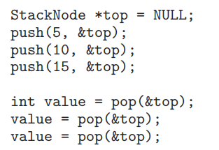

### 作业七

###### 姓名：刘涵之 学号：519021910102

Practice Exercice: 7.8, 7.11, 7.16

------

##### 7.8 The Linux kernel has a policy that a process cannot hold a spinlock while attempting to acquire a semaphore. Explain why this policy is in place.

因为当进程请求获取信号量时，为了等待信号量可能会进入sleep状态，但是在持有自旋锁的时候不能进入sleep状态。


##### 7.11 Discuss the tradeoff between fairness and throughput of operations in the readers–writers problem. Propose a method for solving the readers–writers problem without causing starvation.

公平性：偏向读者的机制（只要没有写者在写，读者就不用等待）会导致写者饥饿；偏向写者的机制（只要写者在写，就不会有新读者开始读）会导致读者饥饿。为了保证公平性（都不饿死），可以加入等待序列，当有新读者到来，如果此时没有读者在读，加入读操作等待序列，如果有读者在读，则等待；当写者写完后，让读操作等待序列中的读者读。

吞吐量：很多读者可以同时读，但是只有一个写者可以同时写，就可以保证吞吐量。


##### 7.16 The C program stack-ptr.c (available in the source-code download) contains an implementation of a stack using a linked list. An example of its use is as follows:



##### This program currently has a race condition and is not appropriate for a concurrent environment. Using Pthreads mutex locks (described in Section 7.3.1), fix the race condition.

```c
#include <pthread.h>

pthread_mutex_t mutex;
pthread_mutex_init(&mutex, NULL);

void saft_push(int a, StackNode *top){
    pthread_mutex_lock(&mutex);
    push(a, &top);
    pthread_mutex_unlock(&mutex);
    return;
}

int saft_pop(StackNode *top){
    int ret;
    pthread_mutex_lock(&mutex);
    ret = pop(&top);
    pthread_mutex_unlock(&mutex);
    return ret;
}
```

