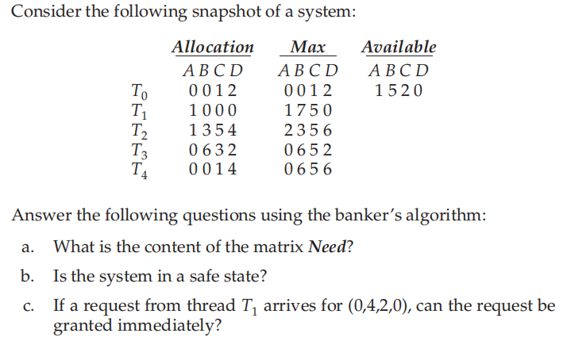
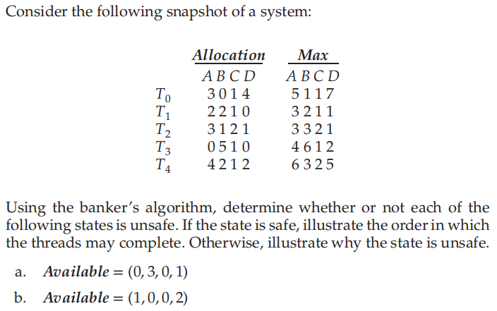
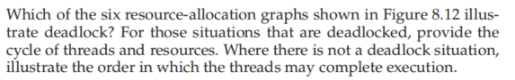
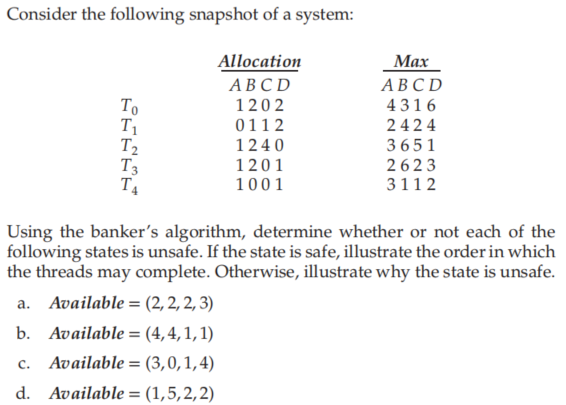
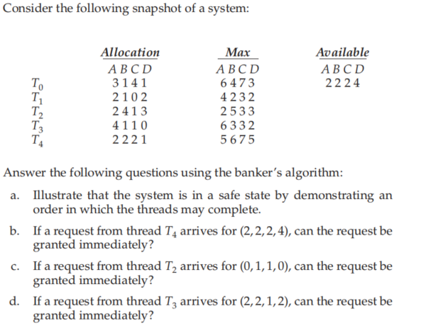

### 作业八

###### 姓名：刘涵之 学号：519021910102

Practice Exercice: 8.3, 8.9, 8.18, 8.27, 8.28

------

##### 8.3 

a. Need:  A	B	C	D

​			T~0~ 0	0	0	0

​			T~1~ 0	7	5	0

​			T~2~ 1	0	0	2

​			T~3~ 0	0	2	0

​			T~4~ 0	6	4	2

b. Yes. 当前状态下T3可以执行，执行后释放资源，然后就可以让任意其他线程执行。

c. Yes. 当前可用资源为 (1 5 2 0)，分配掉(0 4 2 0)后还有(1 1 0 0)，然后可以以T0 -> T2 -> T3 -> T4 -> T1的顺序执行

##### 8.9 

Need:  	A	B	C	D

​			T~0~ 2	1	0	3

​			T~1~ 1	0	0	1

​			T~2~ 0	2	0	0

​			T~3~ 4	1	0	2

​			T~4~ 2	1	1	3

a. 不安全 T2 -> T1 -> T3, 然后因为D资源不足，剩下的线程无法执行

b. 安全 T1 -> T2 -> T3 -> T0 -> T4

##### 8.18 

- (a) 非死锁，T2 -> T3 -> T1
- (b) 死锁，-> T1 -> R3 -> T3 -> R1 ->
- (c) 非死锁， T2 -> T3 -> T1
- (d) 死锁，-> T1,T2 -> R2 -> T3,T4 -> R1 ->
- (e) 非死锁，T2 -> T1 -> T3 -> T4
- (f) 非死锁，T2 -> T4 -> T1 -> T3

##### 8.27 

Need:  	A	B	C	D

​			T~0~ 3	1	1	4

​			T~1~ 2	3	1	2

​			T~2~ 2	4	1	1

​			T~3~ 1	4	2	2

​			T~4~ 2	1	1	1

a. 安全 T4 -> T0 -> T1 -> T2 -> T3

b. 安全 T4 -> T1 -> T0 -> T2 -> T3

c. 不安全 , 所有线程都由于没有B资源而无法执行

d. 安全，T3 -> T4 -> T1 -> T2 -> T3

##### 8.28 

Need:  	A	B	C	D

​			T~0~ 3	3	3	2

​			T~1~ 2	1	3	0

​			T~2~ 0	1	2	0

​			T~3~ 2	2	2	2

​			T~4~ 3	4	5	4

a. T2 -> T3 -> T0 -> T1 -> T4

b. 不能，分配完后系统资源耗尽，没有线程可以执行，陷入死锁

c. 可以，如a的执行顺序， T2 -> T3 -> T0 -> T1 -> T4

d. 可以， T3 -> T2 -> T0 -> T1 -> T4