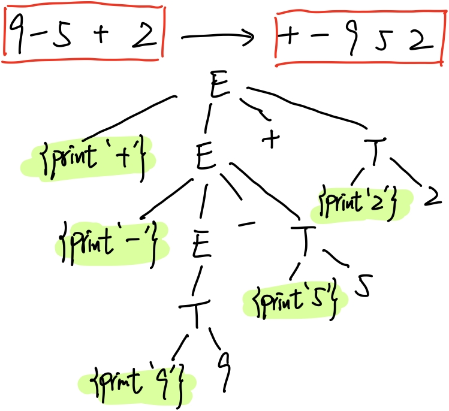

### 第二章作业

###### 姓名：刘涵之 学号：519021910102

------

##### 1.  写出不以0开头的奇数的上下文无关文法。

S -> TO | O

T -> D | TA

A -> 0 | D

D ->  2 | 4 | 6 | 8 | O

O-> 1 | 3 | 5 | 7 | 9

##### 2. 设param为C++语言的实际参数，小写字母a…z和数字0…9可用的符号，参考例2.3和例2.4写出C++函数调用的完整的上下文无关文法。

c++不允许数字开头的命名

call -> functionId ( optParam )

optParam -> params | Є

params -> params , params | param

functionId -> S

param -> S

S  -> L | LK

K -> L | D | LK

L -> a | b | c | d | e | f | g | h | i | j | k | m | n | l | o | p | q | r | s | t | u | v | w | x | y | z

D -> 0 | 1 | 2 | 3 | 4 | 5 | 6 | 7 | 8 | 9

##### 3. 构建一个语法制导翻译方案，该方案把算术表达式从中缀表示方法翻译成前缀表示方法，并给出9-5+2的注释分析树。

| 产生式        | 语义规则                         | 翻译方案(语义动作)      |
| ------------- | -------------------------------- | ----------------------- |
| E -> E~1~ + T | E.t := '+' \|\| E~1~.t \|\| T.t  | E -> {print('+')} E + T |
| E -> E~1~ - T | E.t := '-' \|\| E~1~.t \|\|  T.t | E -> {print('-')} E - T |
| E -> T        | E.t := T.t                       | E -> T                  |
| T -> 0        | T.t := '0'                       | T -> {print('0')} 0     |
| T -> 1        | T.t := '1'                       | T -> {print('1')} 1     |
| T -> 2        | T.t := '2'                       | T -> {print('2')} 2     |
| ...           | ...                              |                         |
| T -> 9        | T.t := '9'                       | T -> {print('9')} 9     |

- 注释分析树

