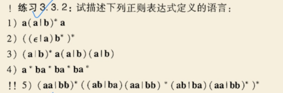
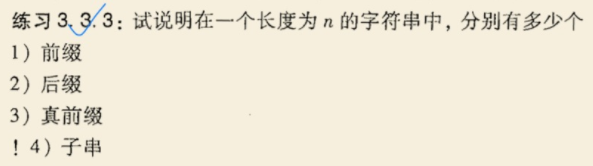
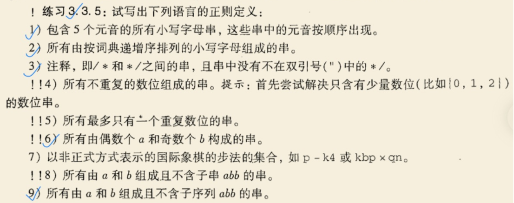

### 第三章作业：正则表达式

###### 姓名：刘涵之 学号：519021910102

Ex. 3.3.2
Ex. 3.3.3（1-4小题）
Ex. 3.3.5（1, 2, 3, 6, 9小题）

------

##### 3.3.2 

1. 开头结尾是a，中间是由0个或多个a或b组成的串：aa，aba，aaa，...
2. 0个或多个a或b组成的串
3. 0个或多个a或b，结尾为aaa，aab，abb，aba的串
4. 0个或多个a或b，且有且只有3个b的串
5. 0个或多个a或b，且a和b的数量都是偶数

##### 3.3.3 

1. n+1个（长度0~n）
2. n+1个（长度0~n）
3. n-1个（去掉长度为n和0的）
4. 子串数=$(n+1)n/2 + 1$。（n个字符，n+1个空位选2个(n+1)C2，加上空串）

##### 3.3.5

1)  seq_aeiou

```rust
seq_aeiou -> non_aeiou* a (a|non_aeiou)* i (i|non_aeiou)* o (o|non_aeiou)* u (u|non_aeiou)*
non_aeiou -> b|c|d|f|g|h|j|k|l|m|n|p|q|r|s|t|v|w|x|y|z
```

2) ans

```rust
ans -> a* b* c* d* e* f* g* h* i* j* k* l* m* n* o* p* q* r* s* t* u* v* w* x* y* z*
```

3) ans

```
ans -> \/\* ( [^"*]* | ".*" | \*+[^/] )* \*\/
```

6) ans

```
ans -> (b|a(ab|ba)(aa|bb)*)(aa|bb)*((ab|ba)(aa|bb)*(ab|ba)(aa|bb)*)*
```

9) ans

```
ans -> b*|b*a+|b*a+ba*
```

