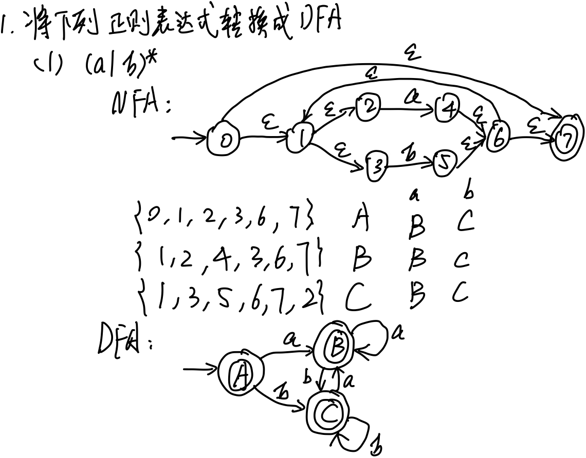
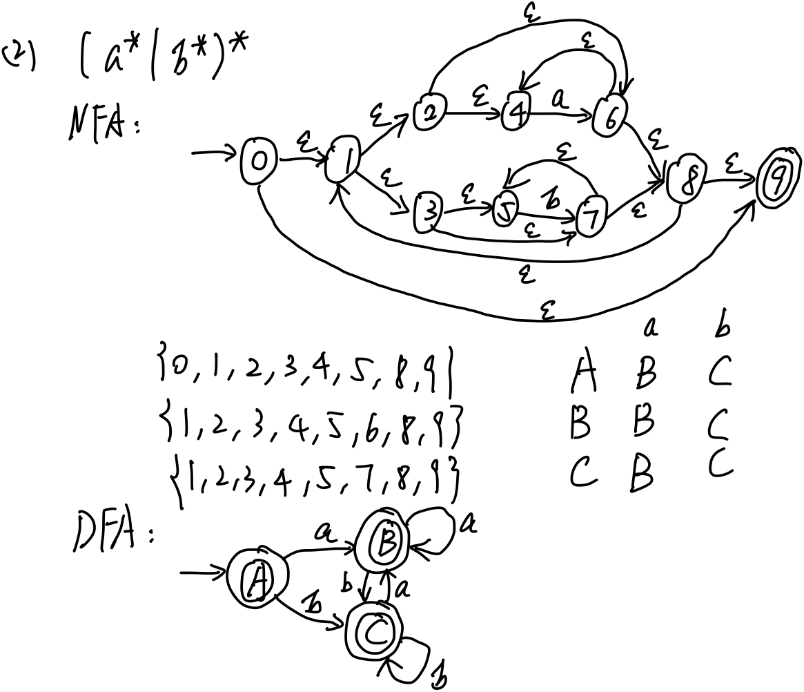
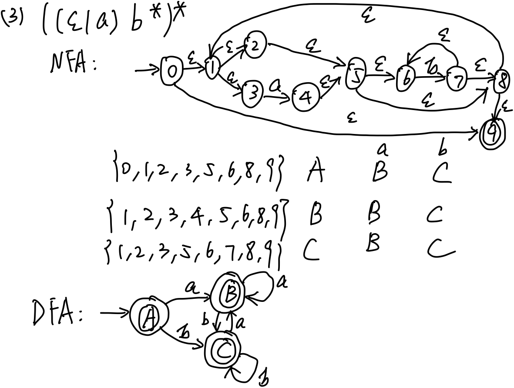
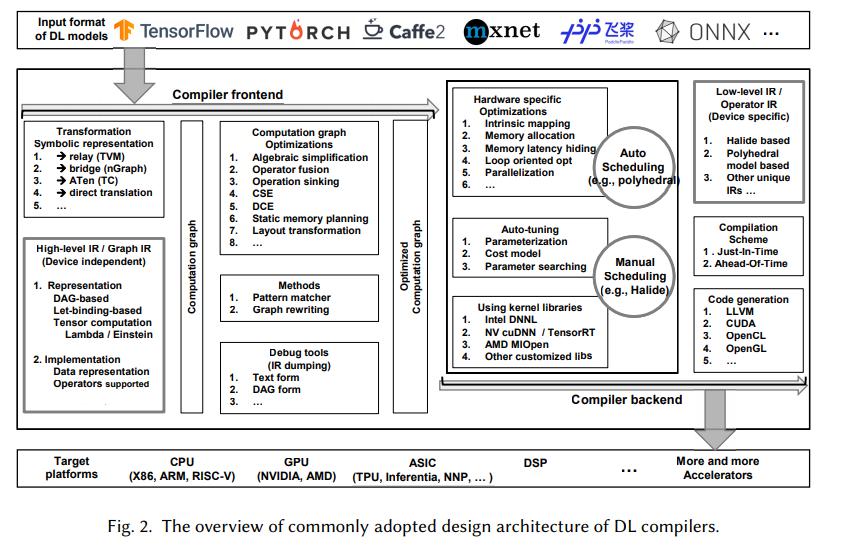

### 第三章作业：从正则表达式到DFA

###### 姓名：刘涵之 学号：519021910102

##### 1、将下列正则表达式转换成DFA：

- (a|b)*
- (a*|b*)*
- ((ε|a)b*)*

##### 2、对于深度学习编译器来说，表达一个深度神经网络的基本语言是什么？

- 深度学习编译器
  - 深度学习：
    - 大量矩阵运算，图像运算
    - 深度神经网络 <- 有向图
  - 传统编译器：
    - 通用，但没有对深度学习所频繁使用的运算、结构进行指令集/编译级别的优化
    - 只支持了+-*/等简单运算的优化，而深度学习需要复杂算子（梯度，卷积）
- 表达深度神经网络的基本语言（高层IR）
  - 网络结构（图结构语言）
    - 结点信息语言
    - 结点间的关系语言（边，方向）
    - 传播语言（前向、反向传播）
  - 矩阵语言
    - 矩阵表示语言
    - 矩阵运算语言
  - 高级运算语言
    - 梯度算子语言（符号运算）
    - 卷积算子语言
  - 图像处理语言
    - 图像表示语言
    - 图像操作语言（缩放变形）
    - 图像比特（RGB）信息提取语言
- *编译优化
  - 

[1] Li M , Y Liu, X Liu, et al. The Deep Learning Compiler: A Comprehensive Survey[J]. 2020.

3. ##### 如果让你设计一种语言，并构造一种词法分析器，你会怎么做？你也可以替换成任何一种感兴趣的语言，如数据库查找SQL等。

- 词法分析器实现策略
  - 简单语言（比如算术运算）
    - 手写
  - 使用 LEX 生成
  - 使用 Parser Combinator （也包括了语法分析部分）
- 编译器前端的自动化工具链很成熟
  - 只写 BNF 或 正则表达式，就可以实现词法 + 一部分语法分析
- 单纯考虑词法分析 -> LEX
  - 编写 .l 文件，将语言词法形式化（正则表达式）表达
    - 为每个可能的 token 设定编号，便于后续分析
  - 使用 LEX 生成 .c 文件
  - 将 .c 文件通过 C 编译器编译成 .out 文件，在后续编译过程中调用