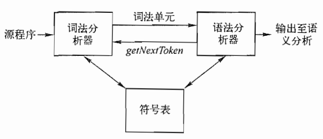
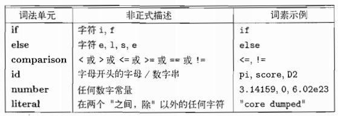
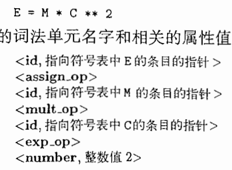
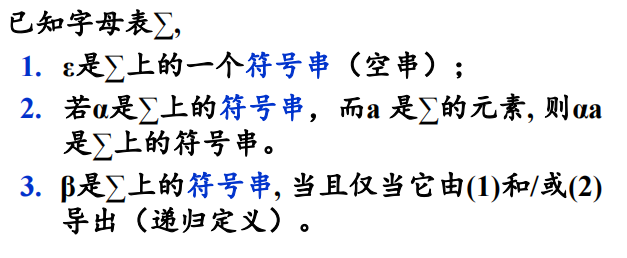
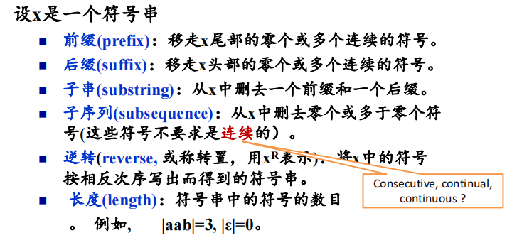
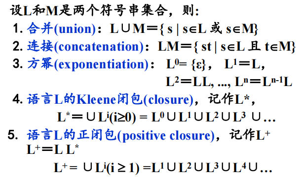
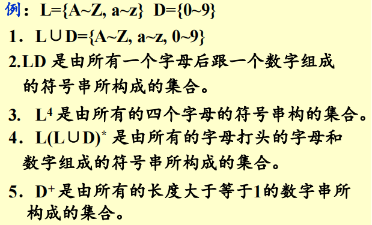
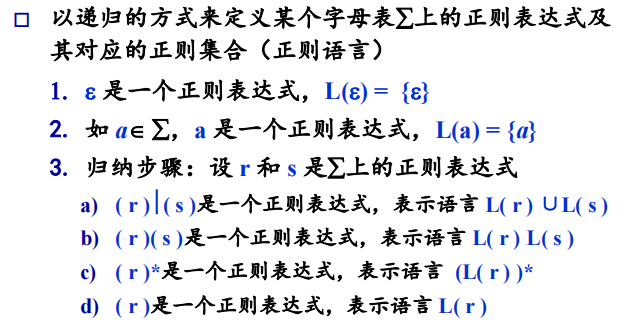
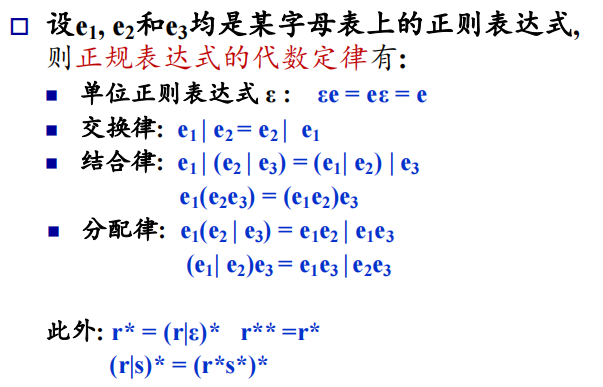

## 词法分析

#### 词法分析作用

- 线性分析（源程序->token）
- 
- Low Level Virtual Machine（LLVM） ->可移植性

#### 词法单元

- 词法单元（token）
  - <单元名，属性值>
  - 单元名：表示种类
  - 单元名->语法分析器
  - 属性值->语义分析器
  - 分类
    - 关键字
    - 常数：每个类型的常数分为一类
    - 属性值
- 模式（pattern）
  - 描述词法单元的词素可能具有的形式
  - 非正式描述/正则表达式
- 词素（lexeme）
  - 和某个词法单元的模式来匹配，识别为该词法单元的实例
- 

#### 词法分析功能

- 识别词法单元
  - 输出词法单元（名称，属性）
  - 转换数字常数（字符串->数值）
  - 去除注释/空白
  - 将编译器生成的错误信息定位到源文件（每个token的行列）
  - 预处理（宏）

- 
  - 分析过程中，有时需要向前看（Fortran，PL/1）
  - 分析过程中，有时需要向后看（C++模板与输出）
- 词法分析可以实现为一遍扫描（pass）
- 词法分析可以作为语法分析和语义分析的子程序

#### 词法单元的规约（Specification）

- 用正则表达式来形式化模式
- 字母表
- 符号串和语言
- 正则表达式
- 正则定义（定义正则表达式的名字）
- 正则表达式的拓展

#### 字母表

- 符号的非空有穷集合
  - 机器语言：0,1
  - Pascal：a-z，A-Z，...

#### 符号串

- 
- 
- 对于符号串 ABCDEFG
  - 前缀：AB
  - 后缀：FG
  - 子串：CDE
  - 子序列：ACEG
  - 逆转：GFEDCBA
  - 长度：7
- 运算
  - 连接（x=ba，y=nana，xy=banana）
  - 方幂（x^1^=ba，x^2^=baba）

#### 语言（符号串集合）

- 给定字母表上一个任意的可数的符号串集合

- 例子

  - 

- 运算（符号串集合之间的运算）

  - 

  - 闭包可以匹配空，正闭包至少有语言本身

  - 

#### 正则表达式

- 

- 

    