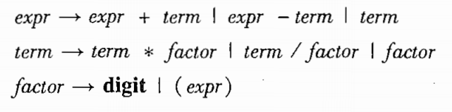
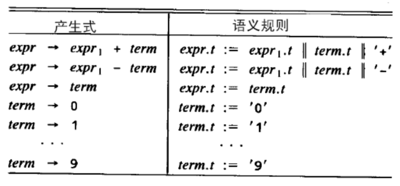
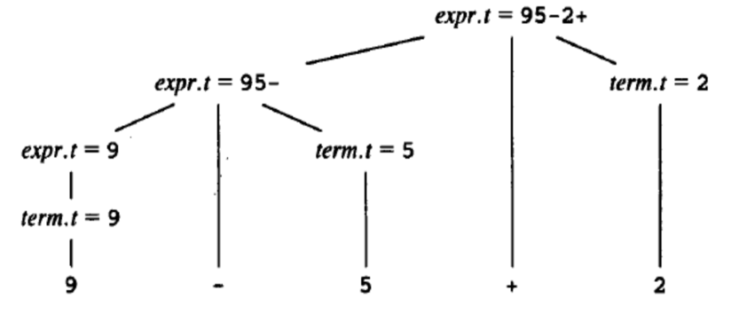
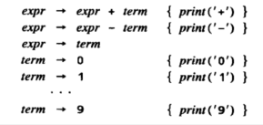
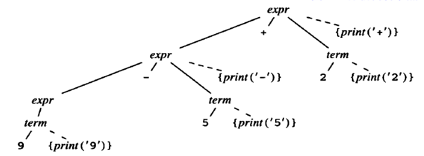

# 第二章

#### 上下文无关文法

- 上下文无关文法
  - 终结符号集合
  - 非终结符号
  - 产生式集合
  - 指定一个非终结符为开始符号
  - 特性
    - 可组合性强
    - 表达式采用同一种产生式
- 算术表达式
- 
  - 运算符优先级
  - 直接左递归 -> 左结合

#### 语法制导翻译

- 语法分析树上每个结点添加**综合属性**
  - 自底向上遍历
  - 语义值
- 定义综合属性：通过产生式定义语义规则
- **文法**和**语义规则**集合构成了**语法制导定义**
- 
- 注释分析树
- 将String变为Constr构成的串
- String: 9-5+2  -> Constr '9' '5' '-' '2' '+'
- 翻译模式
  - 语义动作
  - 采用树的遍历（例如深度优先）
  - 
  - 带语义动作的语法分析树
    - 
    - 深度遍历该树，产生后缀式

