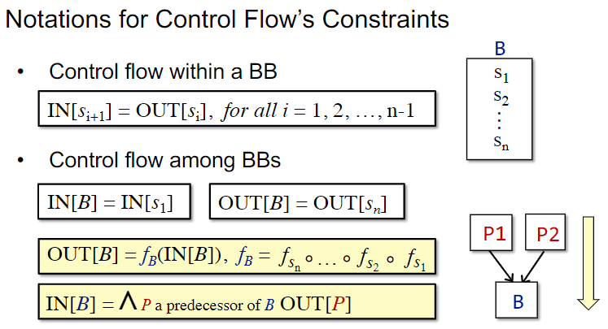
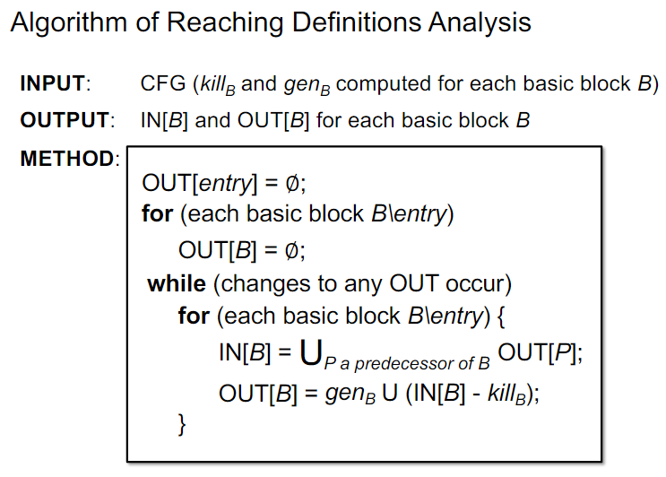
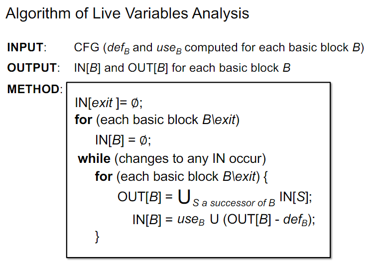
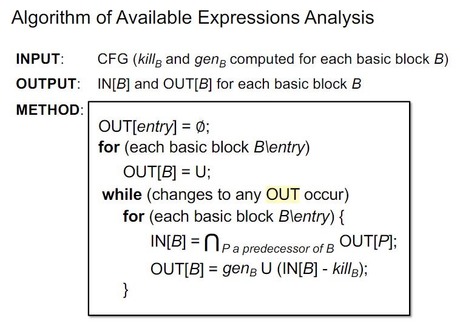
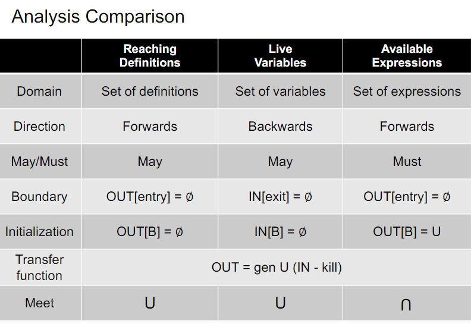

# Static Program Analysis, Part 2

南京大学《软件分析》课程笔记 (Lec 3, 4, 5)

## Data Flow Analysis

How application-specific data flows through the Nodes (BBs/statement) and Edges (control flows) of CFG?

- may analysis
  - outputs information that maybe true(over-approximation) -> sound
- must analysis
  - outputs information that must true(under-approximation) -> complete

## Input and Output States

- input state -> IR statement -> output state
  - IN[s2] = OUT[s1] ;; IN[s2] = IN[s3] = OUT[s1] ;; IN[s2] = OUT[s1] /\ OUT[s3]
- find a solution to a set of **safe-approximation-directed constraints** on the IN/OUT[s]'s, for all statements.
  - constraints based on semantics of statements (transfer function)
  - constraints based on the control flows

## Transfer Function's Constraints

- Forward Analysis
  - OUT[s] = fs(IN[s])
- Backward Analysis
  - IN[s] = fs(OUT[s])
- 

## Reaching Definitions Analysis (Forward)

- A **definition d** at program point **p** reaches a point **q** if there is **a path from p to q** such that d is not “killed” along that path.
  - to detect possible undefined variables
- Transfer function: OUT = gen \/ (IN - kill)
- 
  - gen and kill remain unchanged
  - OUT never shrinks
  - set of facts is finite
  - fixed point
    - IN will not change if OUT do not change
    - OUT will not change if IN do not change

## Live Variables Analysis (Backward)

- Live variables analysis tells whether the value of variable v at program point p could be used along some path in CFG starting at p. If so, v is live at p; otherwise, v is dead at p.
- Transfer function: IN = use \/ (OUT - def)
- 

## Available Expressions Analysis (Forward) (Must Anal)

- An expression ***x op y*** is available at p if 
  - (1) **all** paths from entry to p must pass through the evaluation of ***x op y*** 
  - (2) after the last evaluation of ***x op y***, there is no redefinition of ***x op y***
- We can replace ***x op y*** at program point p by the result of its last evaluation
- 

## Analysis Comparison

- 