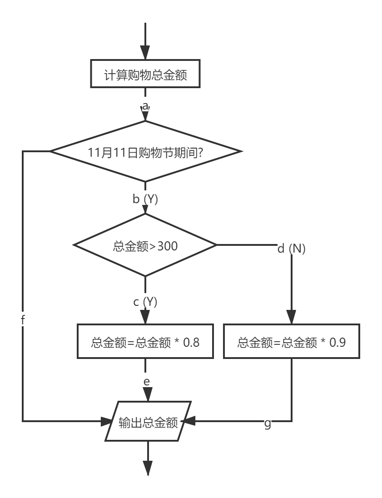

## **第六章作业**

###### 姓名：刘涵之     学号：519021910102

##### 在11月11日购物节期间，购物金额大于300，按照8折给予优惠，其他给予9折优惠，画出程序流程图，要求采用逻辑覆盖的白盒测试方法进行测试。

##### （1）设计一组测试用例实现语句覆盖；

##### （2）设计一组测试用例实现分支覆盖；

##### （3）设计一组测试用例实现条件覆盖。

- 测试用例 —— 语句覆盖
  - 测试用例格式：【（日期，总金额），总金额】
  - 用例：【（11月11日，400），320】    【（11月11日，200），180】   
- 测试用例 —— 分支覆盖
  - 用例：【（11月11日，400），320】覆盖abce
  - 用例：【（11月11日，200），180】覆盖abdg
  - 用例：【（1月1日，400），400】覆盖af
- 测试用例 —— 条件覆盖
  - 用例：【（11月11日，400），320】第一个判断为真，第二个判断为真
  - 用例：【（1月1日，200），200】第一个判断为假，第二个判断为假